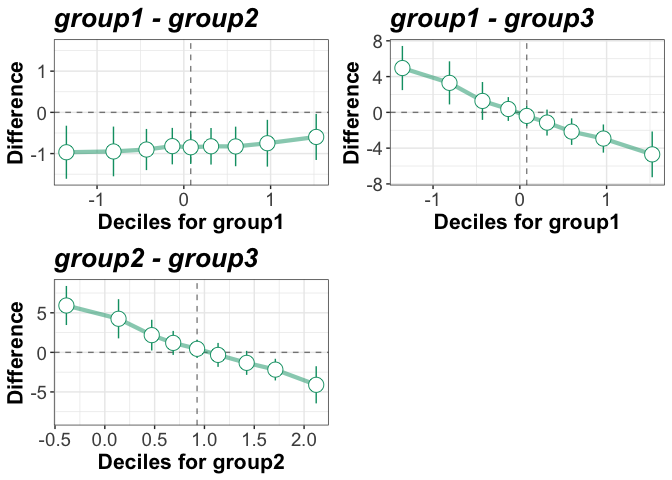

<!-- README.md is generated from README.Rmd. Please edit that file -->

# rogme

Robust Graphical Methods For Group Comparisons (v. 0.2.1)

The `rogme` R package provides graphical tools and robust statistical
methods to compare groups of continous and pseudo-continuous
observations. The goal is to illustrate and quantify how and by how much
groups differ. The current version of the package is limited to
comparing two groups (though multiple pairs of groups can be compared in
one go). Future developments will extend the tools to deal with multiple
groups, interactions and hierarchical designs.

**NEW**: a [hierarchical shift function](docs/hsf.md) to compare two
dependent conditions from one group is now available. It has parametric
and bootstrap versions. The approach is described in [Rousselet &
Wilcox, 2019](https://psyarxiv.com/3y54r/).

The package can be installed using these commands:

``` r
install.packages("devtools")
devtools::install_github("GRousselet/rogme")
```

The approach behind the package can be summarised in one figure:

 **How two independent distributions differ.
Left**: standard but misleading bar graphs of mean values. **Right**:
detailed graphical methods. **A.** Stripcharts of marginal
distributions. Vertical lines mark the deciles, with a thicker line for
the median. **B.** Kernel density representation and rug plot of the
distribution of difference scores. Vertical lines mark the deciles, with
a thicker line for the median. **C.** Shift function. Group 1 - Group 2
is plotted along the y-axis for each decile (white disk), as a function
of Group 1 deciles. The vertical lines indicate 95% bootstrap confidence
intervals. The shift function can be sparser or denser by changing the
quantiles. **D.** Difference asymmetry function with 95% bootstrap
confidence intervals.

The approach is also described in these articles:

[A few simple steps to improve the description of group results in
neuroscience](http://onlinelibrary.wiley.com/doi/10.1111/ejn.13400/full)

[Beyond differences in means: robust graphical methods to compare two
groups in
neuroscience](https://www.biorxiv.org/content/early/2017/03/27/121079).
\[[Reproducibility package using
`rogme`](https://figshare.com/articles/Modern_graphical_methods_to_compare_two_groups_of_observations/4055970)\]

`rogme` uses `ggplot2` for graphical representations, and the main
statistical functions were developed by Rand Wilcox, as part of his
[`WRS`](https://dornsife.usc.edu/labs/rwilcox/software/) package.

The main tool in `rogme` is the [shift
function](https://garstats.wordpress.com/2016/07/12/shift-function/). A
shift function shows the difference between the quantiles of two groups
as a function of the quantiles of one group. For inferences, the
function returns an uncertainty interval for each quantile difference.
By default, the deciles are used. Currently, confidence intervals are
computed using one of two percentile bootstrap techniques. Highest
density intervals and [Bayesian
bootstrap](https://github.com/rasmusab/bayesboot) intervals will be
available eventually.

## Vignettes

  - [Quantify distribution differences using the shift
    function](docs/sf_patterns.md)
  - [Compare two independent groups](docs/ind_gps.md)
  - [Compare two dependent groups](docs/dep_gps.md)
  - [Quantify a single distribution](docs/one_gp.md)
  - [Statistical tests and measures of effect sizes](docs/stats.md)
  - [Hierarchical shift function](docs/hsf.md)

## Functions

All the main functions rely on the [Harrell-Davis quantile
estimator](https://garstats.wordpress.com/2016/06/09/the-harrell-davis-quantile-estimator/),
computed by the `hd()` function.

### Shift function

In the `WRS` package, the shift function can be calculated using:

  - `shifthd()` or `qcomhd()` for independent groups
  - `shiftdhd()` or `Dqcomhd()` for dependent groups

These functions can also produce non-ggplot figures.

In `rogme`, the shift function can be calculated using:

  - `shifthd()` or `shifthd_pbci()` for independent groups
  - `shiftdhd()` or `shiftdhd_pbci()` for dependent groups

Illustrations of the results is handled separately by `plot_sf()`.

You can see the shift function in action for instance in these
publications:

  - [blog
    post](https://garstats.wordpress.com/2016/07/12/shift-function/)

  - [review article in the European Journal of
    Neuroscience](http://onlinelibrary.wiley.com/doi/10.1111/ejn.13100/full)

  - [Sex Differences in the Adult Human Brain: Evidence from 5216 UK
    Biobank
    Participants](https://academic.oup.com/cercor/advance-article/doi/10.1093/cercor/bhy109/4996558)

  - [Visibility graphs for fMRI data: Multiplex temporal graphs and
    their modulations across resting-state
    networks](https://www.mitpressjournals.org/doi/full/10.1162/NETN_a_00012)

  - [Manipulation of contact network structure and the impact on
    foot-and-mouth disease
    transmission](https://www.sciencedirect.com/science/article/pii/S0167587717305627)

  - [No evidence that frontal eye field tDCS affects latency or accuracy
    of
    prosaccades](https://www.biorxiv.org/content/early/2018/06/20/351304)

  - [A Key Characteristic of Sex Differences in the Developing Brain:
    Greater Variability in Brain Structure of Boys than
    Girls](https://www.ncbi.nlm.nih.gov/pubmed/28981610)

### Difference asymmetry function

The difference asymmetry function is another powerful graphical and
inferential tool. In the `WRS` package it is calculated using:

  - `qwmwhd()` for independent groups
  - `difQpci()` for dependent groups

In `rogme`, these functions have been renamed:

  - `asymhd()` for independent groups
  - `asymdhd()` for dependent groups
  - `plot_diff_asym()` to plot the results

You can see the difference asymmetry function in action in this [blog
post](https://garstats.wordpress.com/2016/07/19/typical-differences/)
and in this [review
article](http://onlinelibrary.wiley.com/doi/10.1111/ejn.13100/full).

## Shift function demo \[1\]

Detailed illustration of the shift function using two distributions that
differ in spread. The observations are in arbitrary units (a.u.).

``` r
#> generate data
set.seed(21)
g1 <- rnorm(1000) + 6
g2 <- rnorm(1000) * 1.5 + 6

#> make tibble
df <- mkt2(g1, g2)
```

First, we generate 1D scatterplots for the two groups.

``` r
#> scatterplots alone
ps <- plot_scat2(data = df,
                 formula = obs ~ gr,
                 xlabel = "",
                 ylabel = "Scores (a.u.)",
                 alpha = 1,
                 shape = 21,
                 colour = "grey10",
                 fill = "grey90") #> scatterplots
ps <- ps + coord_flip()
ps
```

<!-- -->

Second, we compute the shift function and then plot it.

``` r
#> compute shift function
sf <- shifthd(data = df, formula = obs ~ gr, nboot = 200)
#> sf <- shifthd_pbci(data = df, formula = obs ~ gr, nboot = 200, q = c(.1,.25,.5,.75,.9))

#> plot shift function
psf <- plot_sf(sf, plot_theme = 2)
#> Warning: Using alpha for a discrete variable is not advised.

#> Warning: Using alpha for a discrete variable is not advised.

#> add labels for deciles 1 & 9
psf <- add_sf_lab(psf, sf, 
                  y_lab_nudge = .1, 
                  text_size = 4)

#> change axis labels
psf[[1]] <- psf[[1]] +  labs(x = "Group 1 quantiles of scores (a.u.)",
                             y = "Group 1 - group 2 \nquantile differences (a.u.)")
psf[[1]]
```

<!-- -->

Third, we make 1D scatterplots with deciles and colour coded
differences.

``` r
p <- plot_scat2(df,
                xlabel = "",
                ylabel = "Scores (a.u.)",
                alpha = .3,
                shape = 21,
                colour = "grey10",
                fill = "grey90") #> scatterplots
p <- plot_hd_links(p, sf[[1]],
                    q_size = 1,
                    md_size = 1.5,
                    add_rect = TRUE,
                    rect_alpha = 0.1,
                    rect_col = "grey50",
                    add_lab = TRUE,
                    text_size = 5) #> superimposed deciles + rectangle
p <- p + coord_flip() #> flip axes
p
```

<!-- -->

Finally, we combine the three plots into one figure.

``` r
library(cowplot)
cowplot::plot_grid(ps, p, psf[[1]], labels=c("A", "B", "C"), ncol = 1, nrow = 3,
                   rel_heights = c(1, 1, 1), label_size = 20, hjust = -0.5, scale=.95)
```

<!-- -->

**Panel A** illustrates two distributions, both n = 1000, that differ in
spread. The observations in the scatterplots were jittered based on
their local density, as implemented in `ggbeeswarm::geom_quasirandom`.

**Panel B** illustrates the same data from panel A. The dark vertical
lines mark the deciles of the distributions. The thicker vertical line
in each distribution is the median. Between distributions, the matching
deciles are joined by coloured lined. If the decile difference between
group 1 and group 2 is positive, the line is orange; if it is negative,
the line is purple. The values of the differences for deciles 1 and 9
are indicated in the superimposed labels.

**Panel C** focuses on the portion of the x-axis marked by the grey
shaded area at the bottom of panel B. It shows the deciles of group 1 on
the x-axis – the same values that are shown for group 1 in panel B. The
y-axis shows the differences between deciles: the difference is large
and positive for decile 1; it then progressively decreases to reach
almost zero for decile 5 (the median); it becomes progressively more
negative for higher deciles. Thus, for each decile the shift function
illustrates by how much one distribution needs to be shifted to match
another one. In our example, we illustrate by how much we need to shift
deciles from group 2 to match deciles from group 1.

More generally, a shift function shows quantile differences as a
function of quantiles in one group. It estimates how and by how much two
distributions differ. It is thus a powerful alternative to the
traditional t-test on means, which focuses on only one, non-robust,
quantity. Quantiles are robust, intuitive and informative.

## Shift function demo \[2\]

The shift function can also be computed for all pairs of groups in a
data frame in one call by using the argument `doall = TRUE`.

``` r
set.seed(21) # generate data
n <- 100 # sample size
library(tibble)
df <- tibble(gr = factor(c(rep("group1",n),rep("group2",n),rep("group3",n))),
             obs= c(rnorm(n), rnorm(n)+1, rnorm(n)*5)) # make tibble
out <- shifthd(df, doall = TRUE) # compute all comparisons
```

Plot all shift functions in one call of `plot_sf`.

``` r
plist <- plot_sf(out)
```

The plots can then be combined using the packages
[gridExtra](https://cran.r-project.org/web/packages/gridExtra/index.html)
or
[cowplot](https://cran.r-project.org/web/packages/cowplot/index.html).

``` r
library(gridExtra)
do.call("grid.arrange", c(plist, ncol=2))
```

<!-- -->

To extract one object and for instance change a label:

``` r
p <- plist[[1]]
p + labs(y = "Difference")
```

<!-- -->

New group plot with different y labels and titles:

``` r
for(sub in 1:length(plist)){
plist[[sub]] <- plist[[sub]] + labs(y = "Difference", title = names(out)[sub]) + theme(plot.title = element_text(size = 20, face = "bold.italic"))
}
do.call("grid.arrange", c(plist, ncol=2))
```

<!-- -->

To understand what’s going on, here are the marginal distributions:

``` r
p <- plot_scat2(df,
                xlabel = "",
                ylabel = "Scores (a.u.)",
                alpha = .5,
                shape = 21,
                colour = "grey10",
                fill = "grey90") #> scatterplots
p + coord_flip() #> flip axes
```

<!-- -->
