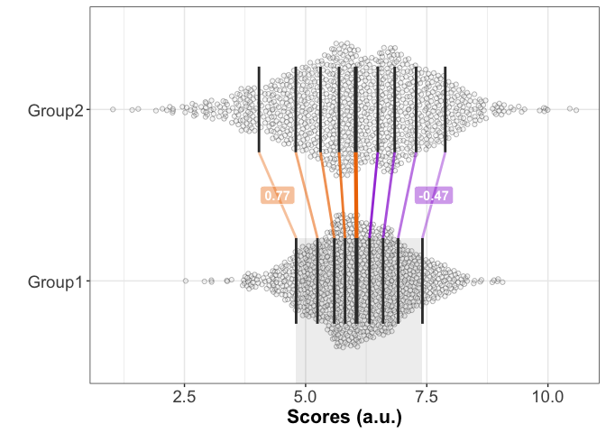

<!-- README.md is generated from README.Rmd. Please edit that file -->
rogme
=====

Robust Graphical Methods For Group Comparisons

**DEVELOPMENT VERSION: not beta tested yet, functions not fully documented...**

The `rogme` R package provides graphical tools to compare groups of continous observations. The goal is to illustrate and quantify how and by how much groups differ. The current version of the package is limited to comparing two groups. Future developments will extend the tools to deal with multiple groups and interactions.

The package can be installed using these commands:

``` r
install.packages("devtools")
devtools::install_github("GRousselet/rogme")
```

The approach behind the package is described here:

[A few simple steps to improve the description of group results in neuroscience](http://onlinelibrary.wiley.com/doi/10.1111/ejn.13400/full)

[Modern graphical methods to compare two groups of observations](https://figshare.com/articles/Modern_graphical_methods_to_compare_two_groups_of_observations/4055970)

`rogme` uses `ggplot2` for graphical representations, and the main statistical functions were developed by Rand Wilcox, as part of his [`WRS`](https://dornsife.usc.edu/labs/rwilcox/software/) package.

The main tool in `rogme` is the shift function. A shift function shows the difference between the quantiles of two groups as a function of the quantiles of one group. For inferences, the function returns an uncertainty interval for each quantile difference. Currently, confidence intervals are computed using one of two percentile bootstrap techniques. Highest density intervals and [Bayesian bootstrap](https://github.com/rasmusab/bayesboot) intervals will be available eventually.

Shift function demo
-------------------

Detailed illustration of the shift function using two distributions that differ in spread.

``` r
# generate data
set.seed(21)
g1 <- rnorm(1000) + 6
g2 <- rnorm(1000) * 1.5 + 6

# make tibble
library(rogme)
#> Loading required package: ggplot2
df <- mkt2(g1, g2)
```

First, we generate the 1D scatterplots for the two groups.

``` r
#> scatterplots alone
ps <- plot_scat2(df,
                 xlabel = "",
                 ylabel = "Scores (a.u.)",
                 alpha = 1,
                 shape = 21,
                 colour = "grey10",
                 fill = "grey90") # scatterplots
ps <- ps + coord_flip()
ps
```


Second, we compute the shift function and then plot it.

``` r
#> compute shift function
sf <- shifthd(data = df, formula = obs ~ gr, nboot = 200)

#> plot shift function
psf <- plot_sf(sf, plot_theme = 2)

#> change axis labels
psf <- psf +
  labs(x = "Group 1 quantiles of scores (a.u.)",
       y = "Group 1 - group 2 \nquantile differences (a.u.)")

#> add labels for deciles 1 & 9
psf <- add_sf_lab(psf, sf, y_lab_nudge = .1)
psf
```


Third, we make 1D scatterplots with deciles and colour coded differences.

``` r
p <- plot_scat2(df,
                xlabel = "",
                ylabel = "Scores (a.u.)",
                symb_alpha = .5,
                symb_col = c("grey70","grey70"),
                symb_fil = c("grey90","grey90")) # scatterplots
#> Warning: Ignoring unknown parameters: symb_alpha, symb_col, symb_fil

p <- plot_dec_links(p, 
                    sf = sf,
                    dec_size = 1,
                    md_size = 1.5,
                    add_rect = TRUE,
                    rect_alpha = 0.1,
                    rect_col = "grey50",
                    add_lab = TRUE) # superimposed deciles + rectangle

p <- p + coord_flip() # flip axes
p
```


Finally, we combine the three plots into one figure.

``` r
library(cowplot)
cowplot::plot_grid(ps, p, psf, labels=c("A", "B", "C"), ncol = 1, nrow = 3,
                   rel_heights = c(1, 1, 1), label_size = 20, hjust = -0.5, scale=.95)
```



<data:image/png;base64,iVBORw0KGgoAAAANSUhEUgAAAAUAAAAJCAYAAAD6reaeAAAAN0lEQVR42mNggIJJ02f+Z0AGE6fN/A8ShEvAOAg86z/DfyyAASvA1D4Toh1ZAK4dIjEL0zxkAQAPeFlrV0HzRgAAAABJRU5ErkJggg>==
