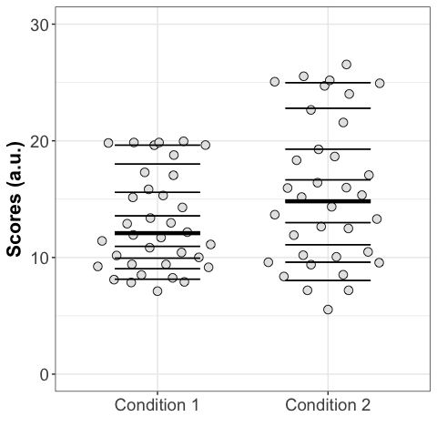
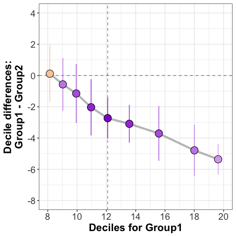
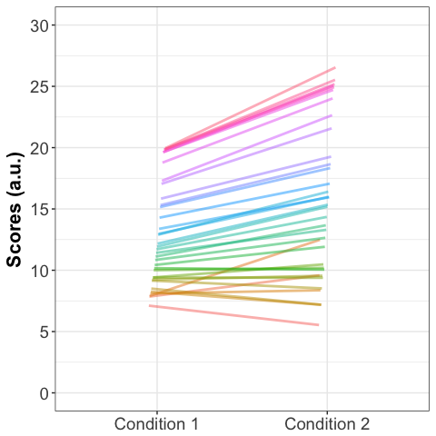
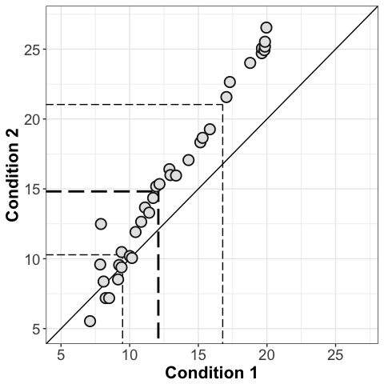
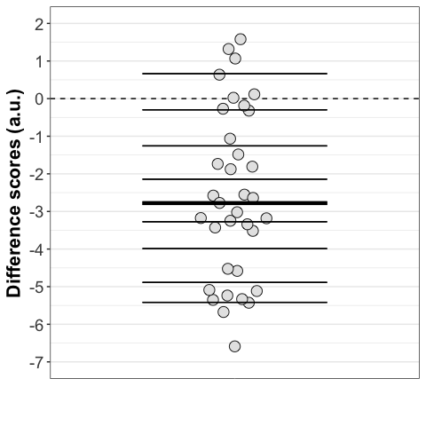
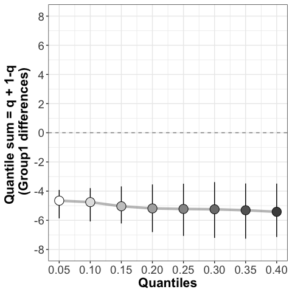
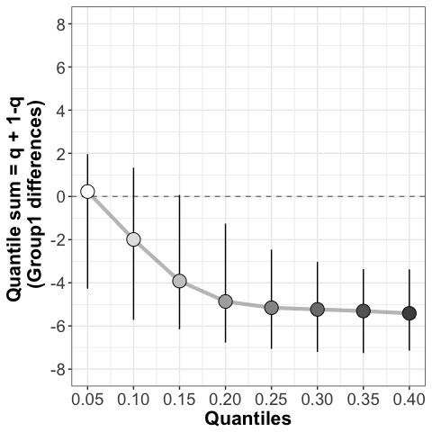

Compare two dependent groups
================
Guillaume A. Rousselet
2018-07-07

-   [Shift function](#shift-function)
-   [Linked stripcharts](#linked-stripcharts)
-   [Scatterplot of paired observations](#scatterplot-of-paired-observations)
-   [Stripchart of differences](#stripchart-of-differences)
-   [Difference asymmetry function](#difference-asymmetry-function)
-   [Summary figure](#summary-figure)
-   [References](#references)

``` r
library(cowplot)
library(tidyr)
```

When comparing dependent groups, we can ask two complementary questions:

-   **Question 1**: How does the typical observation in condition 1 compare to the typical observation in condition 2?
-   **Question 2**: What is the typical difference for a randomly sampled participant?

The next figure shows two dependent distributions, with relatively large differences in the right tails. To address Question 1, ‘How does the typical observation in condition 1 compare to the typical observation in condition 2?’, we consider the median of each condition.

``` r
#> load data
load("./data/paired_example.RData") #> pdata
df <- pdata

#> ----------------------------------------------------
#> independent stripcharts (1D scatterplots)
#> make long format
df.long <- tidyr::gather(df,gr,data,condition1,condition2)
df.long$participant <- as.factor(df.long$participant)
df.long$gr <- as.factor(df.long$gr)
df.wide <- df

#> 1D scatterplots + superimposed deciles
p <- plot_scat2(df.long,
                formula = data ~ gr,
                xlabel = "",
                ylabel = "Scores (a.u.)",
                alpha = 1,
                shape = 21,
                colour = "grey10",
                fill = "grey90",
                size = 3) +
      scale_x_discrete(labels = c("condition1" = "Condition 1","condition2" = "Condition 2")) +
      scale_y_continuous(limits = c(0, 30))

strip <- plot_hd_bars(p,
                      col = "black",
                      q_size = 0.5,
                      md_size = 1.5,
                      alpha = 1)
strip
```



``` r
#> paired t-test on means
t.test(df$condition1,df$condition2,paired=TRUE)
```

    ## 
    ##  Paired t-test
    ## 
    ## data:  df$condition1 and df$condition2
    ## t = -6.7966, df = 34, p-value = 8.11e-08
    ## alternative hypothesis: true difference in means is not equal to 0
    ## 95 percent confidence interval:
    ##  -3.354557 -1.810238
    ## sample estimates:
    ## mean of the differences 
    ##               -2.582397

``` r
#> percentile bootstrap confidence interval of the difference between
#> medians, treating the groups as independent
out <- pb2gen(df$condition1,df$condition2)
```

In condition 1, the median is 12.09; in condition 2, it is 14.82. The difference between the two medians is -2.73, with a 95% confidence interval of \[-5.95, 0.66\].

Shift function
==============

To complement these descriptions, we consider the shift function for dependent groups (Wilcox & Erceg-Hurn, 2012). The shift function addresses an extension of Question 1, by more systematically comparing the distributions. It shows a non-uniform shift between the marginal distributions, with overall trend of growing differences as we progress towards the right tails of the distributions. In other words, among larger observations, observations in condition 2 tend to be higher than in condition 1.

``` r
#> --------------------------
#> compute shift function
set.seed(7)
g2 <- df.long$data[df.long$gr=="condition2"]
g1 <- df.long$data[df.long$gr=="condition1"]
df <- mkt2(g1,g2)
sf <- shiftdhd(data = df, formula = obs ~ gr, nboot = 1000)

#> plot shift function
psf <- plot_sf(sf, plot_theme = 2)[[1]] +
  scale_x_continuous(breaks = seq(6, 20, 2), limits = c(8, 20)) +
  scale_y_continuous(breaks = seq(-8, 4, 2), limits = c(-8, 4))
```

    ## Scale for 'alpha' is already present. Adding another scale for 'alpha',
    ## which will replace the existing scale.

    ## Scale for 'y' is already present. Adding another scale for 'y', which
    ## will replace the existing scale.

``` r
psf
```



Linked stripcharts
==================

Because we are dealing with a paired design, our investigation should not be limited to a comparison of the marginal distributions; it is also important to show how observations are linked between conditions. This association is revealed in two different ways in the next two figures. Looking at the pairing reveals a pattern otherwise hidden: for participants with weak scores in condition 1, differences tend to be small and centred about zero; beyond a certain level, with increasing scores in condition 1, the differences get progressively larger.

``` r
#> ------------------------------------
#> linked stripcharts -----------------
#> coloured lines linking paired observations
pd <- position_dodge(width = 0.1)
linkedstrip <- ggplot(df.long, aes(x=gr, y=data, group=participant)) +
                geom_line(aes(colour=participant),size=1, alpha=.5,
                          position=pd) +
                theme_bw() +
                theme(axis.text.x = element_text(size=14),
                      axis.text.y = element_text(size=14),
                      axis.title.x = element_blank(),
                      axis.title.y = element_text(size=16,face="bold"),
                      legend.position="none") +
                #> labs(title="Paired observations") +
                ylab("Scores (a.u.)") +
                scale_x_discrete(labels = c("condition1" = "Condition 1","condition2" = "Condition 2")) +
                scale_y_continuous(limits=c(0, 30),breaks=seq(0,30,5))
linkedstrip
```



Scatterplot of paired observations
==================================

``` r
#> ----------------------------------------------------
#> scatterplot of paired observations -----------------
scatterdiff <- plot_scat2d(df = df.wide,
                           formula = condition2 ~ condition1,
                           axis.steps=5,
                           colour_p = "grey10",
                           fill_p = "grey90",
                           size_p = 4,
                           alpha_p = 1,
                           colour_q = "black",
                           alpha_q = 1,
                           linetype_q = "longdash",
                           size_q = c(0.5,1,0.5)) +
  xlab("Condition 1") +
  ylab("Condition 2") +
  theme(plot.title = element_blank())
scatterdiff
```



Stripchart of differences
=========================

The next figure shows the distribution of pairwise differences, which let us assess Question 2, ‘What is the typical difference for a randomly sampled participant?’.

``` r
#> ----------------------------------------------------
#> 1D scatterplot = stripchart of differences ---------
paired_differences <- df.long$data[df.long$gr=="condition1"]-df.long$data[df.long$gr=="condition2"]
diff <- mkt1(paired_differences)
set.seed(8)
diffstrip <- ggplot(diff, aes(x=gr,y=obs,fill=gr,colour=gr,shape=gr)) +
  geom_abline(intercept = 0, slope = 0, linetype = 2) +
  ggbeeswarm::geom_quasirandom(alpha = 1,
             shape = 21,
             colour = "grey10",
             fill = "grey90",
             size = 4,
             width = .1) +
  theme_bw() +
  theme(legend.position="none",
        axis.ticks.x = element_line(colour="white"),
        axis.text.x = element_text(size=14,colour="white"),
        axis.text.y = element_text(size=14),
        axis.title.x = element_text(size=16,face="bold",colour="white"),
        axis.title.y = element_text(size=16,face="bold"),
        plot.title = element_text(colour="black",size=20),
        panel.grid.major.x = element_blank(),
        panel.grid.minor.x = element_blank()) +
  xlab("Differences") +
  ylab("Difference scores (a.u.)") +
  scale_y_continuous(limits=c(-7, 2),breaks=seq(-7,2,1))
diffstrip <- plot_hd_bars(diffstrip,
                           col = "black",
                           q_size = 0.5,
                           md_size = 1.5,
                           alpha = 1)
diffstrip
```



The distribution of within-participant differences is shifted downward from zero, with 29 of 35 differences inferior to zero. That's a proportion of 0.83 observations. Matching these observations, only the first decile is superior to zero.

``` r
#> Compute confidence interval of the median of the paired differences
out <- hdpbci(paired_differences)
```

The median difference is -2.78, with a 95% confidence interval of \[-3.53, -1.74\].

Difference asymmetry function
=============================

To complement these descriptions of the difference distribution, we consider the difference asymmetry function for dependent groups (Wilcox & Erceg-Hurn, 2012). The difference asymmetry function extends Question 2 about the typical difference, by considering the symmetry of the distribution of differences. In the case of a completely ineffective experimental manipulation, the distribution of differences should be approximately symmetric about zero. The associated difference asymmetry function should be flat and centred near zero. For the data at hand, the next figure reveals a negative and almost flat function, suggesting that the distribution of differences is almost uniformly shifted away from zero.

``` r
#> --------------------------
#> asymmetry plot
set.seed(7)
dasym <- asymdhd(mkt1(paired_differences), q = seq(5,40,5)/100, alpha = .05, nboot = 1000)

#> ggplot
diff_asym <- plot_diff_asym(data = dasym)[[1]] +
  scale_y_continuous(breaks = seq(-8, 8, 2), limits = c(-8, 8))
```

    ## Scale for 'y' is already present. Adding another scale for 'y', which
    ## will replace the existing scale.

``` r
diff_asym
```



If some participants had particularly large positive differences relative to the participants with the largest negative differences, the left part of the difference asymmetry function would be shifted up compare to the rest of the function (this is illustrated in the next figure), a nonlinearity that would suggest that the differences are not symmetrically distributed – this does not seem to be the case here.

Here we stretch the upper part of the difference distribution (all positive differences are multiplied by 5) to see how that affects the difference asymmetry function: the function is no longer flat, capturing the asymmetry we introduced.

``` r
#> --------------------------
#> asymmetry plot
set.seed(7)
todo <- paired_differences
todo[todo>0] <- todo[todo>0]*5
dasym <- asymdhd(mkt1(todo), q = seq(5,40,5)/100, alpha = .05, nboot = 1000)

#> ggplot
tmp <- plot_diff_asym(data = dasym)[[1]] +
  scale_y_continuous(breaks = seq(-8, 8, 2), limits = c(-8, 8))
```

    ## Scale for 'y' is already present. Adding another scale for 'y', which
    ## will replace the existing scale.

``` r
tmp
```



Summary figure
==============

With the code below, you can use `cowplot` to create a large summary figure.

``` r
#> --------------------------
#> combine plots
cowplot::plot_grid(strip, linkedstrip, scatterdiff, diffstrip, psf, diff_asym,
          labels=c("A", "B", "C", "D", "E", "F"),
          ncol = 2,
          nrow = 3,
          rel_heights = c(1, 1, 1),
          label_size = 18,
          hjust = -1,
          scale = .95,
          align ="v")

# save figure
ggsave(filename='figure_dep_gps.pdf',width=10,height=15)
```

References
==========

Rousselet, G.A., Pernet, C.R. & Wilcox, R.R. (2017) **Beyond differences in means: robust graphical methods to compare two groups in neuroscience.** The European journal of neuroscience, 46, 1738-1748. \[[article](https://onlinelibrary.wiley.com/doi/abs/10.1111/ejn.13610)\] \[[preprint](https://www.biorxiv.org/content/early/2017/05/16/121079)\] \[[reproducibility package](https://figshare.com/articles/Modern_graphical_methods_to_compare_two_groups_of_observations/4055970)\]

Wilcox, R.R. & Erceg-Hurn, D.M. (2012) **Comparing two dependent groups via quantiles.** J Appl Stat, 39, 2655-2664.
