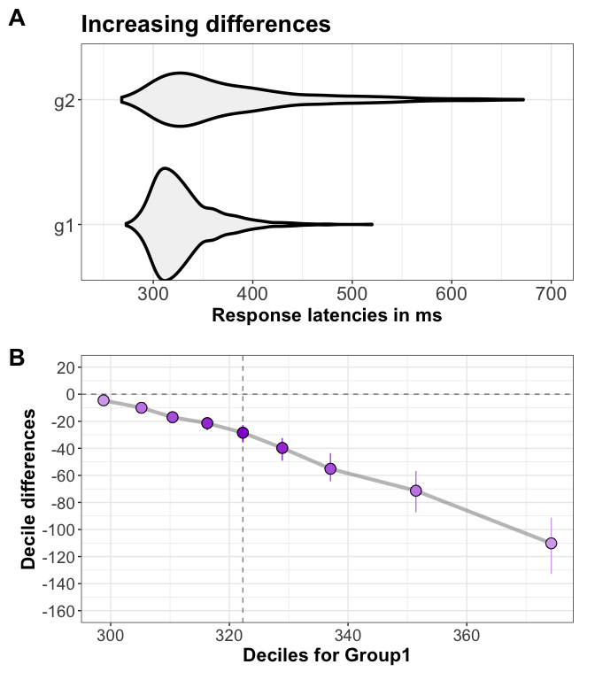

Quantify distribution differences using the shift function
================
Guillaume A. Rousselet
2020-07-10

  - [No clear difference](#no-clear-difference)
  - [Mean difference](#mean-difference)
  - [Skewness difference](#skewness-difference)
  - [Reaction time differences](#reaction-time-differences)
      - [Weak early differences, then increasing
        differences](#weak-early-differences-then-increasing-differences)
      - [Complete shift](#complete-shift)
      - [Early differences, then decreasing
        differences](#early-differences-then-decreasing-differences)
  - [References](#references)

In the README file, we considered the case of 2 independent groups that
differ in spread. To get a better understanding of the shift function,
here we consider other situations in which there is no clear difference,
a difference in mean, a difference in skewness. We also look at how the
shift function can quantify different patterns that can be observed in
skewed observations such as reaction times.

``` r
library(cowplot)
library(ggplot2)
```

# No clear difference

``` r
n = 300 #> number of observations per group
set.seed(6)
g1 <- rnorm(n)
g2 <- rnorm(n)

ks(g1,g2) #> Kolmogorov-Smirnov test
```

    ## $test
    ## [1] 0.05
    ## 
    ## $critval
    ## [1] 0.1108885
    ## 
    ## $p.value
    ## [1] 0.8180342

``` r
t.test(g1,g2) #> regular Welsh t-test
```

    ## 
    ##  Welch Two Sample t-test
    ## 
    ## data:  g1 and g2
    ## t = -0.44817, df = 597.69, p-value = 0.6542
    ## alternative hypothesis: true difference in means is not equal to 0
    ## 95 percent confidence interval:
    ##  -0.1908356  0.1199215
    ## sample estimates:
    ##   mean of x   mean of y 
    ## -0.06072193 -0.02526485

``` r
#> make tibble
df <- mkt2(g1,g2)

#> -------------------------------------------------------
#> scatterplots alone
ps <- plot_scat2(df,
                 xlabel = "",
                 ylabel = "Scores (a.u.)",
                 alpha = 1,
                 shape = 21,
                 colour = "grey10",
                 fill = "grey90")
ps <- ps + coord_flip()
ps <- ps + labs(title = "No clear difference") +
  theme(plot.title = element_text(face = "bold", size = 20))
#> ps

#> compute shift function
sf <- shifthd(data = df, formula = obs ~ gr, nboot = 200)

#> plot shift function
psf <- plot_sf(sf, plot_theme = 2)
```

    ## Warning: Using alpha for a discrete variable is not advised.
    
    ## Warning: Using alpha for a discrete variable is not advised.

``` r
#> change axis labels
psf[[1]] <- psf[[1]] +
            labs(x = "Group 1 quantiles of scores (a.u.)",
                 y = "Group 1 - group 2 \nquantile differences (a.u.)")

#> add labels for deciles 1 & 9
psf <- add_sf_lab(psf, sf, y_lab_nudge = .1, labres = 1, text_size = 4)
#> psf

#> -------------------------------------------------------
#> scatterplot + deciles + colour coded decile differences
p <- plot_scat2(df,
                xlabel = "",
                ylabel = "Scores (a.u.)",
                alpha = .3,
                shape = 21,
                colour = "grey10",
                fill = "grey90")
p <- plot_hd_links(p, sf[[1]],
                    q_size = 1,
                    md_size = 1.5,
                    add_rect = TRUE,
                    rect_alpha = 0.1,
                    rect_col = "grey50",
                    add_lab = TRUE) #> superimposed deciles + rectangle
p <- p + coord_flip() #> flip axes
#> p

cowplot::plot_grid(ps, p, psf[[1]], labels=c("A", "B", "C"), ncol = 1, nrow = 3,
                             rel_heights = c(1, 1, 1), 
                             label_size = 20, 
                             hjust = -0.5, 
                             scale=.95,
                             align = "v")
```

<!-- -->

The figure above illustrates two large samples drawn from a standard
normal population. In that case, a t-test on means in inconclusive (*t*
= -0.45, *P* = 0.65), and so is Kolmogorov-Smirnov test (*KS statistic*
= 0.05, *P* = 0.82). As expected, the shift function shows only weak
differences at all the deciles. This allows us to suggest more
comfortably that the two distributions are similar, which cannot be done
with a t-test because it considers only a very limited aspect of the
data.

The shift function is not perfectly flat, as expected from random
sampling of a limited sample size. The samples are both n = 300, so for
smaller samples even more uneven shift functions can be expected by
chance.

# Mean difference

``` r
set.seed(21)
g1 <- rnorm(n) + 6
g2 <- rnorm(n) + 6.5

ks(g1,g2) #> Kolmogorov-Smirnov test
```

    ## $test
    ## [1] 0.2933333
    ## 
    ## $critval
    ## [1] 0.1108885
    ## 
    ## $p.value
    ## [1] 5.07927e-12

``` r
t.test(g1,g2) #> regular Welsh t-test
```

    ## 
    ##  Welch Two Sample t-test
    ## 
    ## data:  g1 and g2
    ## t = -7.5649, df = 596.1, p-value = 1.477e-13
    ## alternative hypothesis: true difference in means is not equal to 0
    ## 95 percent confidence interval:
    ##  -0.7838508 -0.4607401
    ## sample estimates:
    ## mean of x mean of y 
    ##  6.000446  6.622741

``` r
#> make tibble
df <- mkt2(g1,g2)

#> -------------------------------------------------------
#> scatterplots alone
ps <- plot_scat2(df,
                 xlabel = "",
                 ylabel = "Scores (a.u.)",
                 alpha = 1,
                 shape = 21,
                 colour = "grey10",
                 fill = "grey90")
ps <- ps + coord_flip()
ps <- ps + labs(title = "Mean difference") +
  theme(plot.title = element_text(face = "bold", size = 20),
        axis.text.y = element_blank(),
        axis.title.y = element_blank())
#> ps

#> compute shift function
sf <- shifthd(data = df, formula = obs ~ gr, nboot = 200)

#> plot shift function
psf <- plot_sf(sf, plot_theme = 2)
```

    ## Warning: Using alpha for a discrete variable is not advised.
    
    ## Warning: Using alpha for a discrete variable is not advised.

``` r
#> change axis labels
psf[[1]] <- psf[[1]] +
            labs(x = "Group 1 quantiles of scores (a.u.)",
                 y = "Group 1 - group 2 \nquantile differences (a.u.)")
  #> theme(axis.title.y = element_blank())
        
#> add labels for deciles 1 & 9
psf <- add_sf_lab(psf, sf, y_lab_nudge = .2, labres = 1, text_size = 4)
#> psf

#> -------------------------------------------------------
#> scatterplot + deciles + colour coded decile differences
p <- plot_scat2(df,
                xlabel = "",
                ylabel = "Scores (a.u.)",
                alpha = .3,
                shape = 21,
                colour = "grey10",
                fill = "grey90") +
     theme(axis.text.y = element_blank(),
           axis.title.y = element_blank())
p <- plot_hd_links(p, sf[[1]],
                    q_size = 1,
                    md_size = 1.5,
                    add_rect = TRUE,
                    rect_alpha = 0.1,
                    rect_col = "grey50",
                    add_lab = TRUE) #> superimposed deciles + rectangle
p <- p + coord_flip() #> flip axes
#> p

#> combine plots into one figure
#> library(cowplot)
cowplot::plot_grid(ps, p, psf[[1]], labels=c("A", "B", "C"), ncol = 1, nrow = 3,
                   rel_heights = c(1, 1, 1), 
                   label_size = 20, 
                   hjust = -0.5, 
                   scale=.95,
                   align = "v")
```

<!-- -->

In the figure above, the two distributions differ in central tendency:
in that case, a t-test on means returns a large negative t value (*t* =
-7.56, *P* \< 0.0001), but this is not the full story. The shift
function shows that all the differences between deciles are negative and
around 0.6. That all the deciles show an effect in the same direction is
the hallmark of a completely effective method or experimental
intervention. This consistent shift can also be described as first-order
stochastic ordering, in which one distribution stochastically dominates
another (Speckman et al., 2008).

# Skewness difference

``` r
set.seed(4)
g1 <- rgamma(n, shape = 7, scale = 2)
g2 <- rgamma(n, shape = 7, scale = 2.1)
md.g2 <- hd(g2) #> median
#> g2plot(g1,g2,op=4);abline(v=md.g2)
g2[g2>md.g2] <- sort(g2[g2>md.g2]) * seq(1,1.3,length.out=sum(g2>md.g2))
g1 <- g1*4 + 300
g2 <- g2*4 + 300

ks(g1,g2) #> Kolmogorov-Smirnov test
```

    ## $test
    ## [1] 0.1266667
    ## 
    ## $critval
    ## [1] 0.1108885
    ## 
    ## $p.value
    ## [1] 0.01249136

``` r
t.test(g1,g2) #> regular Welsh t-test
```

    ## 
    ##  Welch Two Sample t-test
    ## 
    ## data:  g1 and g2
    ## t = -3.7351, df = 535.72, p-value = 0.0002078
    ## alternative hypothesis: true difference in means is not equal to 0
    ## 95 percent confidence interval:
    ##  -12.483179  -3.878183
    ## sample estimates:
    ## mean of x mean of y 
    ##  357.3297  365.5104

``` r
#> make tibble
df <- mkt2(g1,g2)

#> -------------------------------------------------------
#> scatterplots alone
ps <- plot_scat2(df,
                 xlabel = "",
                 ylabel = "Scores (a.u.)",
                 alpha = 1,
                 shape = 21,
                 colour = "grey10",
                 fill = "grey90")
ps <- ps + coord_flip()
ps <- ps + labs(title = "Skewness difference") +
  theme(plot.title = element_text(face = "bold", size = 20),
          axis.text.y = element_blank(),
        axis.title.y = element_blank())
#> ps

#> compute shift function
sf <- shifthd(data = df, formula = obs ~ gr, nboot = 200)

#> plot shift function
psf <- plot_sf(sf, plot_theme = 2)
```

    ## Warning: Using alpha for a discrete variable is not advised.
    
    ## Warning: Using alpha for a discrete variable is not advised.

``` r
#> change axis labels
psf[[1]] <- psf[[1]] +
            labs(x = "Group 1 quantiles of scores (a.u.)",
                 y = "Group 1 - group 2 \nquantile differences (a.u.)")
  #> theme(axis.title.y = element_blank())

#> add labels for deciles 1 & 9
psf <- add_sf_lab(psf, sf, y_lab_nudge = 4, labres = 1, text_size = 4)
#> psf

#> -------------------------------------------------------
#> scatterplot + deciles + colour coded decile differences
p <- plot_scat2(df,
                xlabel = "",
                ylabel = "Scores (a.u.)",
                alpha = .3,
                shape = 21,
                colour = "grey10",
                fill = "grey90") +
      theme(axis.text.y = element_blank(),
            axis.title.y = element_blank())
p <- plot_hd_links(p, sf[[1]],
                    q_size = 1,
                    md_size = 1.5,
                    add_rect = TRUE,
                    rect_alpha = 0.1,
                    rect_col = "grey50",
                    add_lab = TRUE) #> superimposed deciles + rectangle
p <- p + coord_flip() #> flip axes
# p

cowplot::plot_grid(ps, p, psf[[1]], labels=c("A", "B", "C"), ncol = 1, nrow = 3,
                             rel_heights = c(1, 1, 1), 
                             label_size = 20, 
                             hjust = -0.5, 
                             scale=.95,
                             align = "v")
```

<!-- -->

In this third figure, similarly to our second example, a t-test on means
also returns a large t value (*t* = -3.74, *P* = 0.0002). However, the
way the two distributions differ is very different from our previous
example: the first five deciles are near zero and follow almost a
horizontal line, and from deciles 5 to 9, differences increase linearly.
The confidence intervals also increase as we move from the left to the
right of the distributions: there is growing uncertainty about the size
of the group difference in the right tails of the distributions.

More generally, the shift function is well suited to investigate how
skewed distributions differ. The figures in the next section illustrate
reaction time data in which a manipulation:

  - affects most strongly slow behavioural responses, but with limited
    effects on fast responses;

  - affects all responses, fast and slow, similarly;

  - has stronger effects on fast responses, and weaker ones for slow
    responses.

# Reaction time differences

The detailed dissociations presented below have been reported in the
literature, and provide much stronger constraints on theories than
comparisons limited to say the median reaction times across participants
(Ridderinkhof et al., 2005; Pratte et al., 2010).

``` r
library(retimes)
```

    ## Reaction Time Analysis (version 0.1-2)

``` r
Nb = 1000 #> number of bootstrap samples
nobs <- 1000 #> number of observations per group
```

## Weak early differences, then increasing differences

**Panel A** = violin plots **Panel B** = shift function

``` r
set.seed(3)
g1 <- rexgauss(nobs, mu=300, sigma=10, tau=30)
g2 <- rexgauss(nobs, mu=300, sigma=17, tau=70)

#> make tibble
df <- mkt2(g1,g2)

#> -------------------------------------------------------
#> violinplots
ps <- ggplot(df, aes(x = gr, y = obs, fill = gr, colour = gr, shape = gr)) + 
  geom_violin(fill = "grey95", colour = "black", size = 1.25) +
  theme_bw() + 
  theme(legend.position = "none") + 
  theme(axis.title.x = element_text(size = 16, face = "bold"), 
        axis.text.x = element_text(size = 16),
        axis.text.y = element_text(size = 16)) + 
  scale_y_continuous(limits=c(250, 700),breaks=seq(200,800,100)) +
  scale_x_discrete(labels = c("g1", "g2"), expand = c(0.02, 0.02)) +
  labs(title = "Increasing differences", x = "", y = "Response latencies in ms") +
  theme(plot.title = element_text(face = "bold", size = 20)) + 
  coord_flip()

#> -------------------------------------------------------
#> compute shift function - deciles
#> sparse: q=c(.25,.5,.75)
#> dense: q=seq(.05,.95,0.05)
set.seed(4)
sf <- shifthd_pbci(data = df, formula = obs ~ gr, q=seq(.1,.9,.1), nboot = Nb)

#> plot shift function
psf <- plot_sf(sf, plot_theme = 2, symb_size = 4)[[1]] + 
  scale_y_continuous(breaks = seq(-160, 20, 20), limits = c(-160, 20)) +
  labs(y = "Decile differences")
```

    ## Warning: Using alpha for a discrete variable is not advised.
    
    ## Warning: Using alpha for a discrete variable is not advised.

``` r
#> psf

#> combine kernel density plots + shift functions
cowplot::plot_grid(ps, psf,
                    labels=c("A", "B"),
                    ncol = 1,
                    nrow = 2,
                    rel_heights = c(1, 1),
                    label_size = 20,
                    hjust = -0.5,
                    scale=.95,
                    align = "v")
```

    ## Warning: Removed 1 rows containing non-finite values (stat_ydensity).

<!-- -->

## Complete shift

``` r
set.seed(3)
g1<-rexgauss(nobs, mu=300, sigma=10, tau=50)
g2<-rexgauss(nobs, mu=300, sigma=10, tau=50) + 50

#> make tibble
df <- mkt2(g1,g2)

#> -------------------------------------------------------
#> violinplots
ps <- ggplot(df, aes(x = gr, y = obs, fill = gr, colour = gr, shape = gr)) + 
  geom_violin(fill = "grey95", colour = "black", size = 1.25) +
  theme_bw() + 
  theme(legend.position = "none") + 
  theme(axis.title.x = element_text(size = 16, face = "bold"), 
        axis.text.x = element_text(size = 16),
        axis.text.y = element_text(size = 16)) + 
  scale_y_continuous(limits=c(250, 700),breaks=seq(200,800,100)) +
  scale_x_discrete(labels = c("g1", "g2"), expand = c(0.02, 0.02)) +
  labs(title = "Complete shift", x = "", y = "Response latencies in ms") +
  theme(plot.title = element_text(face = "bold", size = 20)) + 
  coord_flip()

#> -------------------------------------------------------
#> compute shift function - deciles
set.seed(4)
sf <- shifthd_pbci(data = df, formula = obs ~ gr, q=seq(.1,.9,.1), nboot = Nb)

#> plot shift function
psf <- plot_sf(sf, plot_theme = 2, symb_size = 4)[[1]] +
                  scale_y_continuous(breaks = seq(-100, 20, 20), limits = c(-100, 20)) +
                  labs(y = "Decile differences")
```

    ## Warning: Using alpha for a discrete variable is not advised.
    
    ## Warning: Using alpha for a discrete variable is not advised.

``` r
#> combine kernel density plots + shift functions
cowplot::plot_grid(ps, psf,
                   labels=c("A", "B"),
                   ncol = 1,
                   nrow = 2,
                   rel_heights = c(1, 1),
                   label_size = 20,
                   hjust = -0.5,
                   scale=.95,
                   align = "v")
```

    ## Warning: Removed 1 rows containing non-finite values (stat_ydensity).

<!-- -->

## Early differences, then decreasing differences

``` r
set.seed(1)
g1<-rexgauss(nobs, mu=400, sigma=20, tau=50)
g2<-rexgauss(nobs, mu=370, sigma=20, tau=70)

#> make tibble
df <- mkt2(g1,g2)

#> -------------------------------------------------------
#> violinplots
ps <- ggplot(df, aes(x = gr, y = obs, fill = gr, colour = gr, shape = gr)) + 
  geom_violin(fill = "grey95", colour = "black", size = 1.25) +
  theme_bw() + 
  theme(legend.position = "none") + 
  theme(axis.title.x = element_text(size = 16, face = "bold"), 
        axis.text.x = element_text(size = 16),
        axis.text.y = element_text(size = 16)) + 
  scale_y_continuous(limits=c(200, 700),breaks=seq(200,800,100)) +
  scale_x_discrete(labels = c("g1", "g2"), expand = c(0.02, 0.02)) +
  labs(title = "Early differences", x = "", y = "Response latencies in ms") +
  theme(plot.title = element_text(face = "bold", size = 20)) + 
  coord_flip()

#> -------------------------------------------------------
#> compute shift function - deciles
set.seed(4)
sf <- shifthd_pbci(data = df, formula = obs ~ gr, q=seq(.1,.9,.1), nboot = Nb)

#> plot shift function
psf <- plot_sf(sf, plot_theme = 2, symb_size = 4)[[1]] +
                scale_y_continuous(breaks = seq(-70, 30, 10), limits = c(-70, 30)) +
                labs(y = "Decile differences")
```

    ## Warning: Using alpha for a discrete variable is not advised.
    
    ## Warning: Using alpha for a discrete variable is not advised.

``` r
#> combine kernel density plots + shift functions
cowplot::plot_grid(ps, psf,
                    labels=c("A", "B"),
                    ncol = 1,
                    nrow = 2,
                    rel_heights = c(1, 1),
                    label_size = 20,
                    hjust = -0.5,
                    scale=.95,
                    align = "v")
```

    ## Warning: Removed 19 rows containing non-finite values (stat_ydensity).

<!-- -->

# References

Pratte, M.S., Rouder, J.N., Morey, R.D. & Feng, C.N. (2010) **Exploring
the differences in distributional properties between Stroop and Simon
effects using delta plots.** Atten Percept Psycho, 72, 2013-2025.

Ridderinkhof, K.R., Scheres, A., Oosterlaan, J. & Sergeant, J.A. (2005)
**Delta plots in the study of individual differences: New tools reveal
response inhibition deficits in AD/HD that are eliminated by
methylphenidate treatment.** J Abnorm Psychol, 114, 197-215.

Rousselet, G.A., Pernet, C.R. & Wilcox, R.R. (2017) **Beyond differences
in means: robust graphical methods to compare two groups in
neuroscience.** The European journal of neuroscience, 46, 1738-1748.
\[[article](https://onlinelibrary.wiley.com/doi/abs/10.1111/ejn.13610)\]
\[[preprint](https://www.biorxiv.org/content/early/2017/05/16/121079)\]
\[[reproducibility
package](https://figshare.com/articles/Modern_graphical_methods_to_compare_two_groups_of_observations/4055970)\]

Speckman, P.L., Rouder, J.N., Morey, R.D. & Pratte, M.S. (2008) **Delta
plots and coherent distribution ordering.** Am Stat, 62, 262-266.
