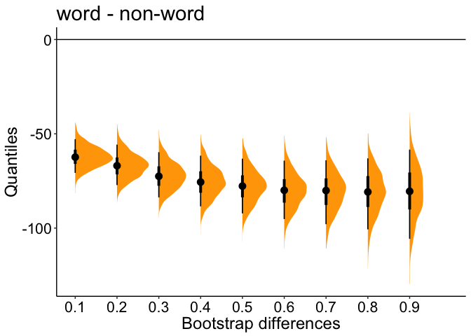

Hierarchical shift function
================
Guillaume A. Rousselet
2019-03-08

-   [Introduction](#introduction)
-   [Example 1: simulated data with a uniform shift](#example-1-simulated-data-with-a-uniform-shift)
    -   [KDE](#kde)
    -   [Shift function](#shift-function)
    -   [Make data for np participants](#make-data-for-np-participants)
    -   [Compute hierarchical shift function](#compute-hierarchical-shift-function)
    -   [Plot hierarchical shift function](#plot-hierarchical-shift-function)
    -   [P values](#p-values)
    -   [Adjusted P values](#adjusted-p-values)
    -   [Stochastic dominance](#stochastic-dominance)
    -   [Percentile bootstrap hierarchical shift function](#percentile-bootstrap-hierarchical-shift-function)
-   [Example 2: simulated data without differences](#example-2-simulated-data-without-differences)
    -   [KDE](#kde-1)
    -   [Shift function](#shift-function-1)
    -   [Make data for np participants](#make-data-for-np-participants-1)
    -   [Compute hierarchical shift function](#compute-hierarchical-shift-function-1)
    -   [Plot hierarchical shift function](#plot-hierarchical-shift-function-1)
    -   [Stochastic dominance](#stochastic-dominance-1)
    -   [Percentile bootstrap hierarchical shift function](#percentile-bootstrap-hierarchical-shift-function-1)
-   [Example 3: real data](#example-3-real-data)
    -   [Get lexical decision dataset](#get-lexical-decision-dataset)
    -   [Compute shift functions for all participants](#compute-shift-functions-for-all-participants)
    -   [Illustrate results](#illustrate-results)
    -   [Stochastic dominance](#stochastic-dominance-2)
    -   [Compute shift functions for a subset of participants](#compute-shift-functions-for-a-subset-of-participants)
    -   [Illustrate results](#illustrate-results-1)
    -   [T-test](#t-test)
    -   [Reverse order of conditions](#reverse-order-of-conditions)
    -   [Quartiles instead of deciles](#quartiles-instead-of-deciles)
    -   [99% confidence intervals](#confidence-intervals)
    -   [More quantiles?](#more-quantiles)
    -   [Percentile bootstrap hierarchical shift function](#percentile-bootstrap-hierarchical-shift-function-2)
-   [References](#references)

``` r
library(tibble)
library(ggplot2)
library(retimes)
```

Introduction
============

In the standard shift function, we compare two vectors of observations at multiple quantiles. Here we deal with a hierarchical setting: we have varying numbers of trials from 2 dependent conditions, sampled from multiple participants. Ideally, such data would be analysed using a multi-level model, including for instance ex-Gaussian fits, random slopes and intercepts for participants, item analyses... This can be done using the [lme4](https://github.com/lme4/lme4) or [brms](https://github.com/paul-buerkner/brms) R packages.

However, in some research fields, the common approach is to collapse the variability across trials into a single number per participant and condition to be able to perform a paired t-test: typically, the mean is computed across trials for each condition and participant, then the means are subtracted, and the distribution of mean differences is entered into a one-sample t-test. Obviously, this strategy throws away a huge amount of information!

Depending on how conditions differ, looking at other aspects of the data than the mean can be more informative. For instance, in Rousselet & Wilcox (2019), we consider group comparisons of individual medians. Considering that the median is the second quartile, looking at the other quartiles can be of theoretical interest to investigate effects in early or later parts of distributions. This could be done in several ways, for instance by making inferences on the first quartile (Q1) or the third quartile (Q3). If the goal is to detect differences anywhere in the distributions, a more systematic approach consists in quantifying differences at multiple quantiles. Here we consider the case of the deciles, but other quantiles could be used. First, for each participant and each condition, the sample deciles are computed over trials. Second, for each participant, condition 2 deciles are subtracted from condition 1 deciles - we’re dealing with a within-subject (repeated-measure) design. Third, for each decile, the distribution of differences is subjected to a one-sample test. Fourth, a correction for multiple comparisons is applied across the 9 one-sample tests. We call this procedure a **hierarchical shift function**. There are many options available to implement this procedure and the example used here is not the definitive answer: the goal is simply to demonstrate that a relatively simple procedure can be much more powerful and informative than standard approaches.

In creating a hierarchical shift function we need to make three choices: a quantile estimator, a statistical test to assess quantile differences across participants, and a correction for multiple comparisons technique. The deciles are estimated using type 8 from the base R `quantile()` function (see justification in Rousselet & Wilcox, 2019). The group comparisons are performed using a one-sample t-test for the 20% trimmed mean, which performs well in many situations. The correction for multiple comparisons employs Hochberg’s strategy (Hochberg, 1988), which guarantees that the probability of at least one false positive will not exceed the nominal level as long as the nominal level is not exceeded for each quantile. All these defaults can be changed - see `help(hsf)`.

In Rousselet & Wilcox (2019), we consider power curves for the hierarchical shift function (HSF) and contrast them to other approaches: by design, HSF is sensitive to more types of differences than any standard approach using the mean or a single quantile. Another advantage of HSF is that the location of the distribution difference can be interrogated, which is impossible if inferences are limited to a single quantile.

Example 1: simulated data with a uniform shift
==============================================

First, we consider a uniform shift between two ex-Gaussian distributions. In condition 1, the ex-Gaussian parameters were mu = 500, sigma = 50 and tau = 200. Parameters in condition 2 were the same, but each sample was shifted by 50.

Illustrate data from one participant, 1000 trials per condition.

KDE
---

``` r
nt <- 1000
# ex Gaussian parameters
mu <- 500
sigma <- 50
tau <- 200
ES <- 50

set.seed(21)
g1 <- rexgauss(nt, mu = mu, sigma = sigma, tau = tau) 
g2 <- rexgauss(nt, mu = mu, sigma = sigma, tau = tau) + ES
df <- mkt2(g1, g2, group_labels = c("Condition1", "Condition2"))

p <- ggplot(df, aes(x = obs)) + theme_classic() + 
  stat_density(aes(colour = gr), geom="line",position="identity", size=1) +
  scale_colour_viridis_d(end = 0.8) +
  coord_cartesian(xlim = c(0, 2500)) +
  theme(axis.title.x = element_text(size = 18),
        axis.text.x = element_text(size = 16, colour="black"),
        axis.text.y = element_text(size = 16, colour="black"),
        axis.title.y = element_text(size = 18),
        legend.key.width = unit(1.5,"cm"),
        legend.position = c(0.55,0.75),
        legend.direction = "vertical",
        legend.text=element_text(size=16),
        legend.title=element_text(size=18),
        title = element_text(size=20)) +
  labs(x = "Reaction times", y = "Density", colour = "Conditions") +
  ggtitle("Uniform shift")
p
```


``` r
# p.uni.dist <- p
```

Shift function
--------------

To better understand how the distributions differ, let's look at the standard shift function, in which the difference between the deciles of the two conditions are plotted as a function of the deciles in condition 1. The decile differences are all negative, showing stochastic dominance of condition 2 over condition 1. The function is not flat because of random sampling and limited sample size.

``` r
out <- shifthd_pbci(df, nboot = 200, adj_ci = FALSE)
p <- plot_sf(out, plot_theme = 1)[[1]] + 
     theme(axis.text = element_text(size = 16, colour="black"))
p
```


Make data for np participants
-----------------------------

``` r
set.seed(747)

nt <- 100 # trials
np <- 30 # participants
# ex Gaussian parameters
mu <- 500
sigma <- 50
tau <- 200
ES <- 50

# generate data: matrix participants x trials
data1 <- matrix(rexgauss(nt*np, mu = mu, sigma = sigma, tau = tau), nrow = np)
data2 <- matrix(rexgauss(nt*np, mu = mu, sigma = sigma, tau = tau), nrow = np) + ES

# analysis parameters
qseq <- seq(0.1,0.9,0.1) # quantiles
alpha <- 0.05
nboot <- 1000 # bootstrap
tr <- 0.2 # group trimmed mean for each quantile
nq <- length(qseq)
```

Compute hierarchical shift function
-----------------------------------

``` r
df <- tibble(rt = c(as.vector(data1), as.vector(data2)),
             cond = factor(c(rep("cond1", nt*np),rep("cond2", nt*np))),
             id = factor(rep(seq(1,np),nt*2)))
out <- hsf(df, rt ~ cond + id)
```

Plot hierarchical shift function
--------------------------------

``` r
p <- plot_hsf(out)
p
```


P values
--------

``` r
out$pvalues
```

    ## [1] 4.627365e-11 6.080292e-11 3.737277e-11 6.334578e-07 5.635363e-10
    ## [6] 1.646131e-08 3.683236e-10 1.389007e-06 2.415958e-03

Adjusted P values
-----------------

``` r
out$adjusted_pvalues
```

    ## [1] 3.701892e-10 4.256204e-10 3.363549e-10 1.900373e-06 2.817682e-09
    ## [6] 6.584525e-08 2.209942e-09 2.778014e-06 2.415958e-03

Stochastic dominance
--------------------

Does one condition dominate the other at all quantiles? In how many participants? See Speckman et al. (2008) for a great introduction to stochastic dominance.

### Participants with all quantile differences &gt; 0

``` r
nq <- length(out$quantiles)
pdmt0 <- apply(out$individual_sf > 0, 2, sum)
print(paste0('In ',sum(pdmt0 == nq),' participants (',round(100 * sum(pdmt0 == nq) / np, digits = 1),'%), all quantile differences are more than to zero'))
```

    ## [1] "In 0 participants (0%), all quantile differences are more than to zero"

### Participants with all quantile differences &lt; 0

``` r
pdlt0 <- apply(out$individual_sf < 0, 2, sum)
print(paste0('In ',sum(pdlt0 == nq),' participants (',round(100 * sum(pdlt0 == nq) / np, digits = 1),'%), all quantile differences are less than to zero'))
```

    ## [1] "In 22 participants (73.3%), all quantile differences are less than to zero"

Percentile bootstrap hierarchical shift function
------------------------------------------------

Use the percentile bootstrap to compute confidence intervals.

Hierarchical situation: nt trials at level 2, two conditions compared using a shift function (default = deciles) in each of np participants at level 1. For each decile of the shift function, we perform a one-sample test on the 20% trimmed mean. The deciles are dependent, so we resample participants, then trials (hierarchical sampling).

### Compute bootstrap samples

``` r
set.seed(8899)
out <- hsf_pb(df, rt ~ cond + id)
```

### Plot bootstrap confidence intervals

``` r
plot_hsf_pb(out, interv = "ci")
```


### Plot bootstrap highest density intervals - default

``` r
plot_hsf_pb(out, interv = "hdi")
```


### Plot bootstrap distributions

Distributions of bootstrap estimates can be considered cheap [Bayesian posterior distributions](http://www.sumsar.net/blog/2015/04/the-non-parametric-bootstrap-as-a-bayesian-model/). They also contain useful information not captured by simply reporting confidence intervals. Here we plot them using `geom_halfeyeh()` from [tidybayes](https://github.com/mjskay/tidybayes).

``` r
plot_hsf_pb_dist(out)
```


With 80% confidence interval, median of bootstrap differences and different colours

``` r
plot_hsf_pb_dist(out, point_interv = median_ci, interval_width = .80, 
                 int_colour = "blue", fill_colour = "grey")
```


Example 2: simulated data without differences
=============================================

Second, we consider samples from the same two ex-Gaussian distributions. In both conditions, the ex-Gaussian parameters were mu = 500, sigma = 50 and tau = 200.

Illustrate data from one participant, 1000 trials per condition.

KDE
---

``` r
nt <- 1000
# ex Gaussian parameters
mu <- 500
sigma <- 50
tau <- 200
ES <- 0

set.seed(21)
g1 <- rexgauss(nt, mu = mu, sigma = sigma, tau = tau) 
g2 <- rexgauss(nt, mu = mu, sigma = sigma, tau = tau) + ES
df <- mkt2(g1, g2, group_labels = c("Condition1", "Condition2"))

p <- ggplot(df, aes(x = obs)) + theme_classic() + 
  stat_density(aes(colour = gr), geom="line",position="identity", size=1) +
  scale_colour_viridis_d(end = 0.8) +
  coord_cartesian(xlim = c(0, 2500)) +
  theme(axis.title.x = element_text(size = 18),
        axis.text.x = element_text(size = 16, colour="black"),
        axis.text.y = element_text(size = 16, colour="black"),
        axis.title.y = element_text(size = 18),
        legend.key.width = unit(1.5,"cm"),
        legend.position = c(0.55,0.75),
        legend.direction = "vertical",
        legend.text=element_text(size=16),
        legend.title=element_text(size=18),
        title = element_text(size=20)) +
  labs(x = "Reaction times", y = "Density", colour = "Conditions") +
  ggtitle("Uniform shift")
p
```


Shift function
--------------

To better understand how the distributions differ, let's look at the standard shift function, in which the difference between the deciles of the two conditions are plotted as a function of the deciles in condition 1. The decile differences are all negative, showing stochastic dominance of condition 2 over condition 1. The function is not flat because of random sampling and limited sample size. In fact, even with 1,000 trials, large differences are suggested for middle and upper deciles.

``` r
out <- shifthd_pbci(df, nboot = 200, adj_ci = FALSE)
p <- plot_sf(out, plot_theme = 1)[[1]] + 
     theme(axis.text = element_text(size = 16, colour="black"))
p
```


Make data for np participants
-----------------------------

``` r
set.seed(747)

nt <- 100 # trials
np <- 30 # participants
# ex Gaussian parameters
mu <- 500
sigma <- 50
tau <- 200
ES <- 0

# generate data: matrix participants x trials
data1 <- matrix(rexgauss(nt*np, mu = mu, sigma = sigma, tau = tau), nrow = np)
data2 <- matrix(rexgauss(nt*np, mu = mu, sigma = sigma, tau = tau), nrow = np) + ES

# analysis parameters
qseq <- seq(0.1,0.9,0.1) # quantiles
alpha <- 0.05
nboot <- 1000 # bootstrap
tr <- 0.2 # group trimmed mean for each quantile
nq <- length(qseq)
```

Compute hierarchical shift function
-----------------------------------

``` r
df <- tibble(rt = c(as.vector(data1), as.vector(data2)),
             cond = factor(c(rep("cond1", nt*np),rep("cond2", nt*np))),
             id = factor(rep(seq(1,np),nt*2)))
out <- hsf(df, rt ~ cond + id)
```

Plot hierarchical shift function
--------------------------------

``` r
p <- plot_hsf(out)
p
```


Stochastic dominance
--------------------

### Participants with all quantile differences &gt; 0

``` r
nq <- length(out$quantiles)
pdmt0 <- apply(out$individual_sf > 0, 2, sum)
print(paste0('In ',sum(pdmt0 == nq),' participants (',round(100 * sum(pdmt0 == nq) / np, digits = 1),'%), all quantile differences are more than to zero'))
```

    ## [1] "In 3 participants (10%), all quantile differences are more than to zero"

### Participants with all quantile differences &lt; 0

``` r
pdlt0 <- apply(out$individual_sf < 0, 2, sum)
print(paste0('In ',sum(pdlt0 == nq),' participants (',round(100 * sum(pdlt0 == nq) / np, digits = 1),'%), all quantile differences are less than to zero'))
```

    ## [1] "In 4 participants (13.3%), all quantile differences are less than to zero"

Percentile bootstrap hierarchical shift function
------------------------------------------------

### Compute bootstrap samples

``` r
set.seed(8899)
out <- hsf_pb(df, rt ~ cond + id)
```

### Plot bootstrap highest density intervals - default

``` r
plot_hsf_pb(out, interv = "hdi")
```


### Plot bootstrap distributions

``` r
plot_hsf_pb_dist(out)
```


Example 3: real data
====================

Get lexical decision dataset
----------------------------

Data from the [French Lexicon Project](https://sites.google.com/site/frenchlexicon/results). Click on "French Lexicon Project trial-level results with R scripts.zip". The `.RData` dataset was created by applying the script `/data-raw/getflprtdata.Rmd`.

``` r
#> get data - tibble = `flp`
flp <- flp # reaction time data - check `help(flp)`
#> columns =
#> - 1 = participant
#> - 2 = rt
#> - 3 = acc = accuracy 0/1
#> - 4 = condition = word/non-word
np <- length(unique(flp$participant)) # number of participants
```

Compute shift functions for all participants
--------------------------------------------

Because of the large number of participants, the confidence intervals are too narrow to be visible.

``` r
out <- hsf(flp, rt ~ condition + participant,
                qseq = seq(0.1,0.9,0.1),
                tr = 0.2,
                alpha = 0.05,
                qtype = 8,
                todo = c(1,2),
                null.value = 0,
                adj_method = "hochberg")
```

Illustrate results
------------------

``` r
# fig.width = 5, fig.height = 3
plot_hsf(out)
```


Stochastic dominance
--------------------

### Participants with all quantile differences &gt; 0

``` r
nq <- length(out$quantiles)
pdmt0 <- apply(out$individual_sf > 0, 2, sum)
print(paste0('In ',sum(pdmt0 == nq),' participants (',round(100 * sum(pdmt0 == nq) / np, digits = 1),'%), all quantile differences are more than to zero'))
```

    ## [1] "In 13 participants (1.4%), all quantile differences are more than to zero"

### Participants with all quantile differences &lt; 0

``` r
pdlt0 <- apply(out$individual_sf < 0, 2, sum)
print(paste0('In ',sum(pdlt0 == nq),' participants (',round(100 * sum(pdlt0 == nq) / np, digits = 1),'%), all quantile differences are less than to zero'))
```

    ## [1] "In 798 participants (83.2%), all quantile differences are less than to zero"

Compute shift functions for a subset of participants
----------------------------------------------------

``` r
set.seed(19)
id <- unique(flp$participant)
df <- subset(flp, flp$participant %in% sample(id, 50, replace = FALSE))
out <- hsf(df, rt ~ condition + participant)
```

Illustrate results
------------------

``` r
# fig.width = 5, fig.height = 3
plot_hsf(out)
```


T-test
------

``` r
# remove all variability across trials 
dfred <- na.omit(tapply(df$rt, list(df$participant, df$condition), mean))
t.test(dfred[,1], dfred[,2], paired = TRUE)
```

    ## 
    ##  Paired t-test
    ## 
    ## data:  dfred[, 1] and dfred[, 2]
    ## t = -9.9517, df = 49, p-value = 2.363e-13
    ## alternative hypothesis: true difference in means is not equal to 0
    ## 95 percent confidence interval:
    ##  -91.14614 -60.51992
    ## sample estimates:
    ## mean of the differences 
    ##               -75.83303

Reverse order of conditions
---------------------------

``` r
out <- hsf(df, rt ~ condition + participant,
                todo = c(2,1))
plot_hsf(out)
```


Quartiles instead of deciles
----------------------------

``` r
plot_hsf(hsf(df, rt ~ condition + participant, qseq = c(0.25, 0.5, 0.75)))
```


99% confidence intervals
------------------------

``` r
plot_hsf(hsf(df, rt ~ condition + participant, alpha = 0.01))
```


More quantiles?
---------------

With about 1000 trials per condition we can study the distributions in more detail.

``` r
p <- plot_hsf(hsf(df, rt ~ condition + participant, qseq = seq(0.05, 0.95, 0.05)))
p + theme(axis.text.x = element_text(size = 10))
```


Percentile bootstrap hierarchical shift function
------------------------------------------------

### Compute bootstrap samples

``` r
set.seed(8899)
out <- hsf_pb(df, rt ~ condition + participant)
```

### Plot bootstrap highest density intervals - default

``` r
plot_hsf_pb(out, interv = "hdi")
```


### Plot bootstrap distributions

``` r
plot_hsf_pb_dist(out)
```



References
==========

Rousselet, G. A., & Wilcox, R. R. (2019). **Reaction times and other skewed distributions: problems with the mean and the median.** \[[preprint](https://psyarxiv.com/3y54r/)\] \[[reproducibility package](https://figshare.com/articles/Reaction_times_and_other_skewed_distributions_problems_with_the_mean_and_the_median/6911924)\]

Ferrand, L., New, B., Brysbaert, M., Keuleers, E., Bonin, P., Méot, A., Augustinova, M., & Pallier, C. (2010). **The French Lexicon Project: Lexical decision data for 38,840 French words and 38,840 pseudowords.** Behavior Research Methods, 42, 488-496. \[[article](https://link.springer.com/article/10.3758/BRM.42.2.488)\]\[[dataset](https://sites.google.com/site/frenchlexicon/results)\]

Speckman, P. L., Rouder, J. N., Morey, R. D. & Pratte, M. S. (2008). **Delta plots and coherent distribution ordering.** The American Statistician, 62(3), 262–266. \[[article](http://pcl.missouri.edu/sites/default/files/Speckman-etal-2008.pdf)\]
